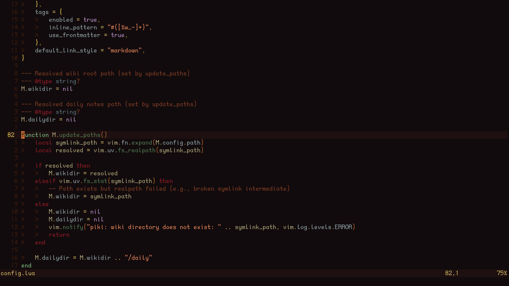
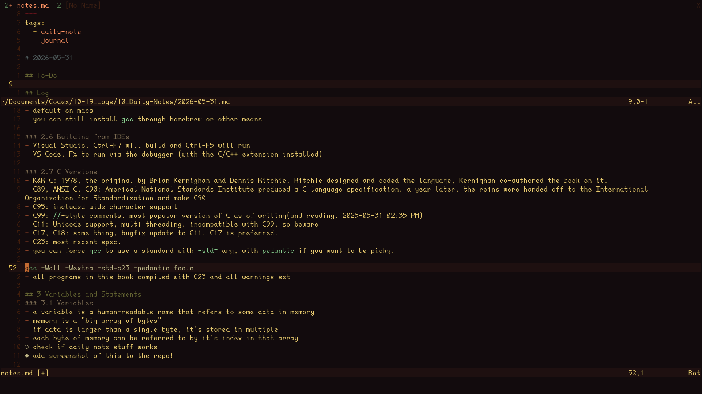

> My custom neovim splash page. Code from [minintro](https://github.com/eoh-bse/minintro.nvim)
---

> Examples of my colorscheme, based off the [MonaLisa iterm2 colorscheme](https://iterm2colorschemes.com/)
